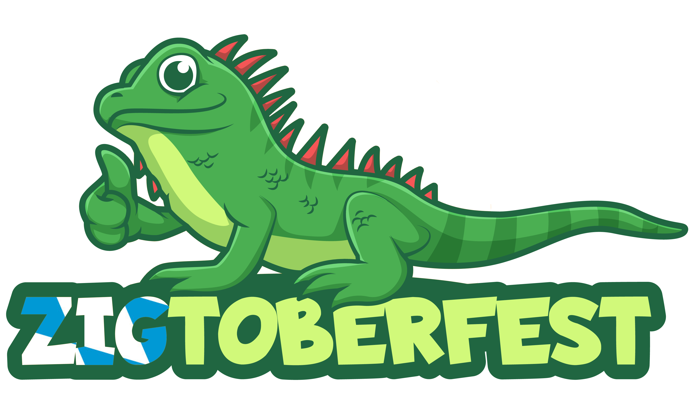

---
{
    .title = "Home",
    .date = @date("2020-07-06T00:00:00"),
    .author = "David Pierre Sugar",
    .draft = false,
    .layout = "index.shtml",
    .tags = [],
}  
--- 

# What is Zigtoberfest?
Zigtoberfest, launched in 2024, is a conference focused on sharing experience and knowledge among the Zig community. This event is a fantastic chance to connect with like-minded individuals from the Zig community and share your passion for programming. 

You can find the recordings of Zigtoberfest 2024 on [Youtube](https://www.youtube.com/@zigtoberfest/videos).

The event is open to everyone--all at no cost! We have limited seats available so make sure to <a href="https://www.eventbrite.de/e/zigtoberfest-2025-tickets-1209874409929?aff=oddtdtcreator" target="_blank">Register Now</a>!

The Name Zigtoberfest is a combination of the words Zig (the programming language) and Oktoberfest, as the event takes place in Munich. It was coined by [Rene](https://renerocks.ai/) during a discussion on Discord.

# What is Zig?

[Zig](https://ziglang.org/) is a general-purpose programming language and toolchain for maintaining robust, optimal and reusable software. Among other things, it offers a fresh approach to metaprogramming based on compile-time code execution and lazy evaluation. Zig can also be used as a zero-dependency, drop-in C/C++ compiler that supports cross-compilation out-of-the-box.

# Want to give a talk at Zigtoberfest?

[Click here](https://form.jotform.com/241586649790068) to submit a proposal for a presentation at Zigtoberfest, we'd love to hear your ideas!

# Event Details

- Date: Saturday Oct 25th 2025
- Location: University of Applied Sciences Munich, **R 0.058**
- Time: 9am - 5:30pm (09:00 - 17:30 Uhr)

