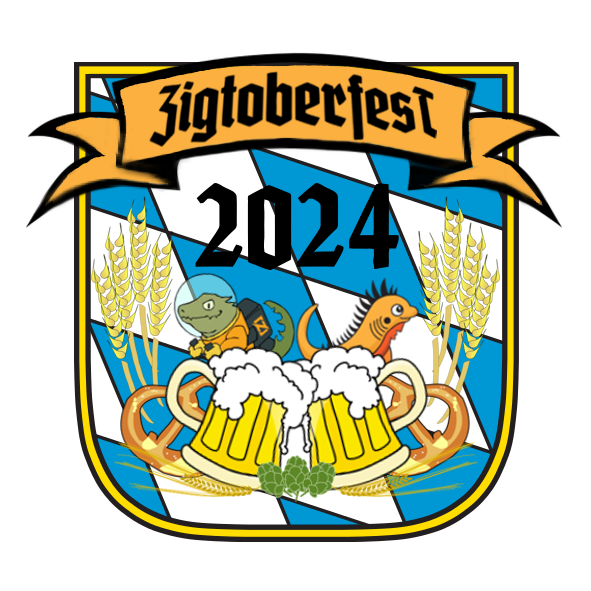

---
{
    .title = "Home",
    .date = @date("2020-07-06T00:00:00"),
    .author = "David Pierre Sugar",
    .draft = false,
    .layout = "index.shtml",
    .tags = [],
}  
--- 

# What is Zigtoberfest?
Zigtoberfest is a half-day event filled with insightful talks organized by the <a href="https://ziglang.org/">Zig</a> community in Munich. This event is a fantastic chance to connect with like-minded individuals from the Zig community and share your passion for programming.

The event is open to everyone--all at no cost! We have limited seats available so make sure to <a href="https://form.jotform.com/241653144540046" target="_blank">Register Now</a>!

# Program

The program is tentative and may be subject to changes.

All times are in central european summer time.
