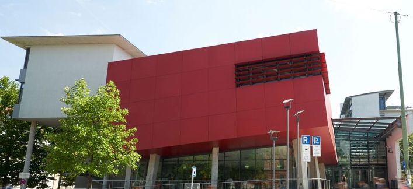
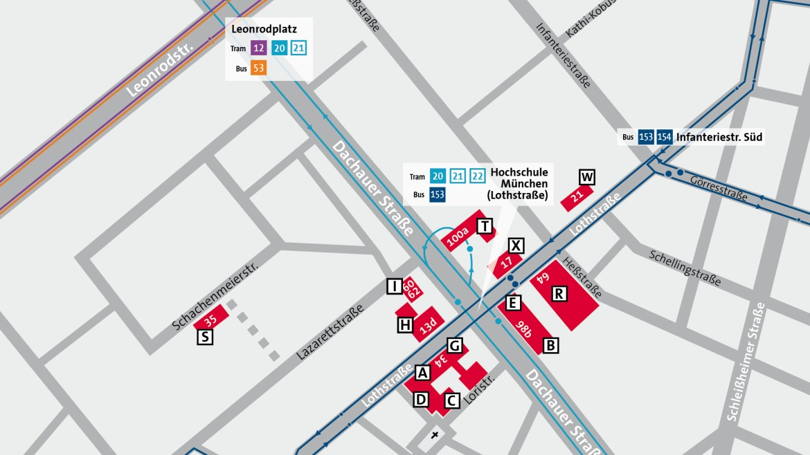

---
{
    .title = "Location",
    .date = @date("2020-07-06T00:00:00"),
    .author = "David Pierre Sugar",
    .draft = false,
    .layout = "page.shtml",
    .tags = [],
}  
--- 

The event will take place at the university of applied science in Munich, **Lothstraße 64 80335 Munich, Germany, R 0.058**. 

You can reach the location using the tram lines 20, 21, and 22 or by bus using line 153. You can also use the Metro M2 (exit Therensienstraße).

It is recommended to [join the Zig Discord server](https://discord.gg/zig). 
